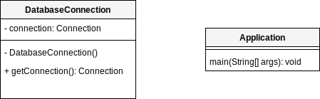

- [Singleton Pattern](#singleton-pattern)
  * [When to use it?](#when-to-use-it-)
  * [Consequences](#consequences)
      - [Pros](#pros)
      - [Cons](#cons)
  * [Class Diagram](#class-diagram)
      - [Estructure](#estructure)
      - [Implementation](#implementation)

# Singleton Pattern

Pattern under the creational patterns category.

All access is centralized to an instance. This means that all changes made to
that object, are reflected in all other "instances".

In this pattern, there is a class, containing a one constructor. The instance is
instantiated whenever the object is called for the first time using the method 
_getSingleton()_. Thereonafter, the same instance of the object is called until
that object is destroyed.

## When to use it?
- Resources where access (read/write) should be controlled, like database or 
remote connections.

## Consequences

#### Pros
- Allows reducing the number of instances.
- Avoids having to use Global Variables: no pollution in variables names space
to store the instances.

#### Cons
- Having subclasses of a singleton is not adviced as encapsulation breaks down:
private constructor should not be used in parent class; a subclass of a Singleton
is not a Singleton.

## Class Diagram

#### Estructure

#### Implementation

